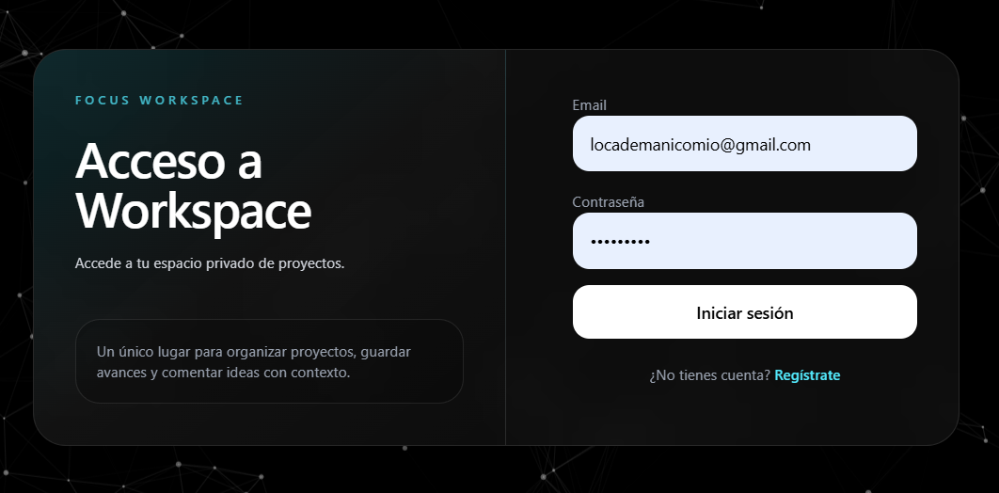

# 🚀 Semana 9 — Next.js + Auth + Dashboard Privado

## 🌐 Demo

👉 https://codenode-semana7.vercel.app/

## 👑 Cuenta demo administrador

Para probar el panel de administración puede utilizarse la siguiente cuenta demo:

Email: locademanicomio@gmail.com
Password: 123456789

⚠️ Cuenta utilizada únicamente con fines de demostración y pruebas del proyecto.



---

# ⚠️ Evolución del proyecto

La práctica original estaba planteada como un pequeño portfolio privado desarrollado con Next.js, autenticación y SQLite local.

Durante el desarrollo, el proyecto evolucionó hacia una aplicación más cercana a un entorno real de trabajo, transformándose en un dashboard privado de gestión de proyectos personales con autenticación, roles y persistencia en la nube.

Inicialmente la aplicación utilizaba SQLite junto con `better-sqlite3`, lo que permitía trabajar correctamente en entorno local, pero presentaba limitaciones en producción debido al funcionamiento serverless de plataformas como Vercel.

Por ello, posteriormente se realizó una migración completa de SQLite hacia PostgreSQL utilizando Supabase como proveedor cloud de base de datos.

Esta migración permitió:

- persistencia real de datos en producción
- autenticación funcional online
- almacenamiento permanente de usuarios y sesiones
- arquitectura más cercana a aplicaciones SaaS modernas
- despliegue completo en Vercel

---

## 🌐 Descripción

En esta práctica he desarrollado una aplicación web con Next.js enfocada en autenticación, gestión de usuarios y paneles privados.

El proyecto evolucionó desde un portfolio básico hacia un pequeño dashboard privado de gestión de proyectos personales, incorporando funcionalidades reales de aplicaciones modernas como login, roles, comentarios y panel de administración.

---

## ⚙️ Funcionalidades implementadas

### 🔐 Autenticación
- Registro de usuarios
- Inicio de sesión
- Logout funcional
- Manejo de sesiones con Better Auth
- Protección de rutas privadas
- Persistencia real de sesiones con PostgreSQL

### 👤 Perfil de usuario
- Página `/perfil`
- Edición del nombre de usuario
- Saludo personalizado dinámico
- Visualización del rol del usuario

### 📁 Gestión de proyectos
- CRUD completo de proyectos
- Creación, edición y eliminación
- Proyectos asociados al usuario autenticado
- Filtrado de proyectos por usuario

### 💬 Comentarios
- Sistema de comentarios en proyectos
- Asociación entre usuario, proyecto y comentario
- Comentarios protegidos por sesión autenticada

### 👑 Panel Admin
- Ruta protegida `/admin`
- Acceso exclusivo para usuarios con rol `admin`
- Estadísticas generales:
  - número de usuarios
  - número de proyectos
  - número de comentarios

---

## 🔄 Migración SQLite → PostgreSQL (Supabase)

Después de finalizar la práctica original, se decidió realizar una migración completa de la base de datos para acercar el proyecto a un entorno más profesional y funcional en producción.

### Cambios realizados durante la migración

- Eliminación completa de SQLite y `better-sqlite3`
- Migración de la aplicación a PostgreSQL
- Integración de Supabase como proveedor cloud
- Adaptación de Better Auth a PostgreSQL
- Creación automática de tablas y relaciones
- Refactorización de queries SQL
- Protección adicional de APIs mediante sesiones reales
- Validación de propiedad de proyectos y comentarios
- Persistencia de usuarios y sesiones en producción
- Limpieza completa del proyecto y preparación para deploy real

---

## 🗄️ Base de datos

### Versión inicial
- SQLite
- better-sqlite3

### Versión final
- PostgreSQL
- Supabase

### Tablas principales
- `user`
- `session`
- `account`
- `verification`
- `proyectos`
- `comentarios`

---

## 🧠 Conceptos trabajados

Durante esta práctica se trabajaron conceptos importantes de desarrollo web moderno:

- autenticación
- sesiones
- protección de rutas
- roles de usuario
- relaciones entre tablas
- renderizado dinámico
- manejo de estado autenticado
- paneles privados
- CRUDs completos
- APIs protegidas
- persistencia cloud
- migración de bases de datos
- despliegue full stack
- estructura de aplicaciones reales con Next.js

---

## 🛠️ Tecnologías utilizadas

- Next.js
- TypeScript
- TailwindCSS
- Better Auth
- PostgreSQL
- Supabase
- Vercel

---

## 📦 Instalación

Clonar repositorio:

```bash
git clone https://github.com/JessicaNoLimit/codenode-semana7