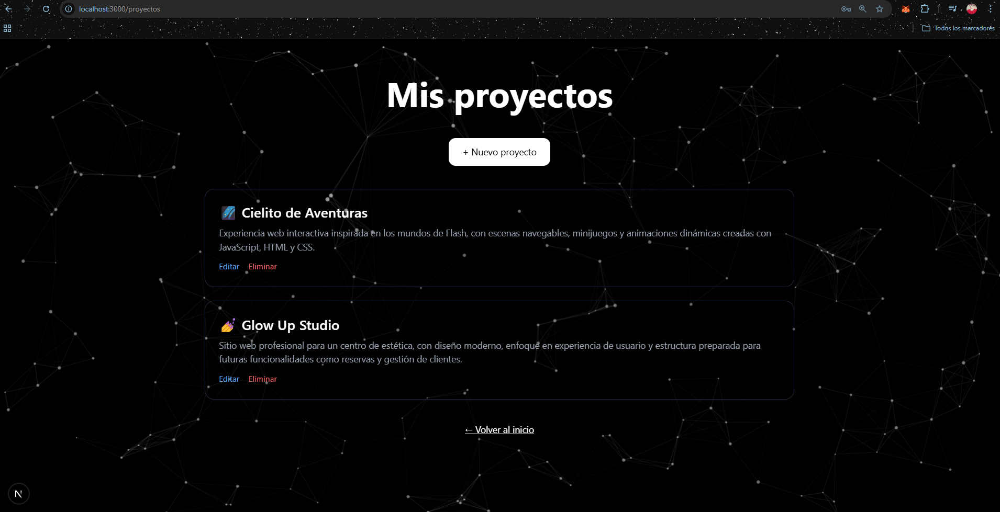

🚀 Semana 7 / 8 - Next.js + API + Autenticación

🌐 Descripción

En esta práctica he desarrollado una aplicación web completa con Next.js, evolucionando desde el consumo de una API de WordPress hasta una aplicación con autenticación de usuarios y gestión de proyectos propia.

El objetivo ha sido simular un entorno de desarrollo real, trabajando tanto con consumo de APIs externas como con la creación de una API interna, autenticación y operaciones CRUD.

⚠️ Nota sobre producción (Vercel)

La aplicación está desplegada en Vercel:

👉 https://codenode-semana7.vercel.app/

Debido al uso de SQLite como base de datos local, los datos no persisten en producción, ya que Vercel utiliza un entorno serverless.

Para un entorno real, se debería utilizar una base de datos externa como:

Supabase
PlanetScale
Railway

⚙️ Funcionalidades

Página de inicio (/) con presentación personal
Sistema de autenticación:
Registro de usuarios (/register)
Inicio de sesión (/login)
Protección de rutas privadas
Página de proyectos (/proyectos) protegida por autenticación
Creación de nuevos proyectos
Edición de proyectos existentes
Eliminación de proyectos
Listado dinámico de proyectos
Navegación entre páginas

🔐 Autenticación

Se ha implementado un sistema de autenticación con Better Auth, que permite:

Registro de usuarios mediante email y contraseña
Inicio de sesión seguro
Protección de rutas (solo usuarios autenticados pueden acceder a /proyectos)

🧠 Tecnologías utilizadas
Next.js
React
TypeScript
Tailwind CSS
Better Auth
SQLite (base de datos local)
API Routes (Next.js)

📁 Estructura del proyecto
/ → Página de inicio
/login → Inicio de sesión
/register → Registro de usuario
/proyectos → Listado de proyectos (protegido)
/proyectos/nuevo → Crear proyecto
/proyectos/[slug] → Detalle de proyecto
/proyectos/editar/[id] → Editar proyecto
/api/auth → Endpoints de autenticación
/api/proyectos → API para gestión de proyectos

🔌 API propia

Se ha desarrollado una API interna con Next.js para gestionar los proyectos:

GET /api/proyectos → Obtener todos los proyectos
POST /api/proyectos → Crear nuevo proyecto
PUT /api/proyectos → Editar proyecto
DELETE /api/proyectos → Eliminar proyecto

✅ Resultado

El resultado es una aplicación funcional que:

Implementa autenticación real de usuarios
Protege rutas privadas
Permite gestionar proyectos (CRUD)
Simula un flujo completo de desarrollo web profesional
Está desplegada en producción

👩‍💻 Autor

Jesica Serrano